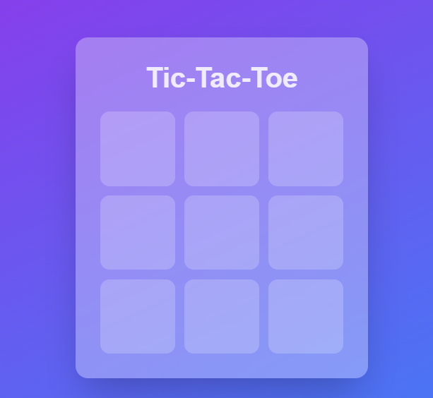
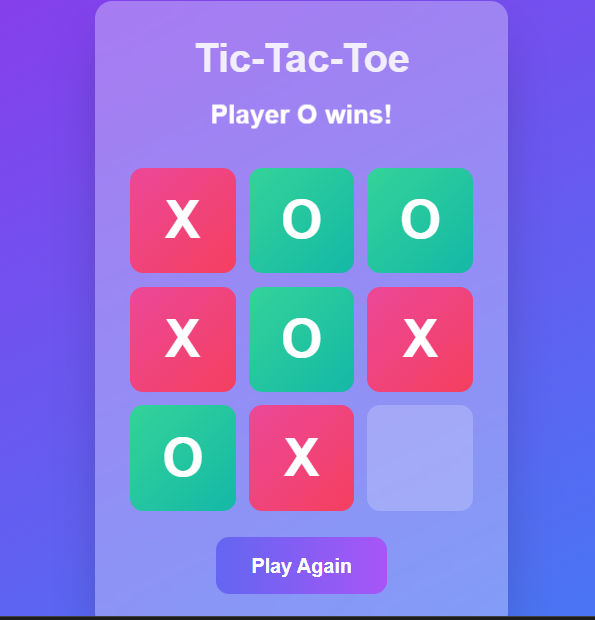

# 🎮 **Tic-Tac-Toe Game**

A simple and interactive **Tic-Tac-Toe** game built using **React** with **Tailwind CSS**. Play as Player **X** or **O**, with a responsive UI and real-time game state updates.

---
## 📸 Screenshots

---

## 📌 **Features**  
✅ Play as Player **X** or **O**  
✅ Detects winner or tie after each turn  
✅ Animations  
✅ Play again option once the game ends  
✅ Clean and modern UI with a gradient background  

---

## 🛠️ **Tech Stack**  
- **Frontend:** React.js  
- **Styling:** Tailwind CSS  
- **Deployment:** Vercel / Netlify  

